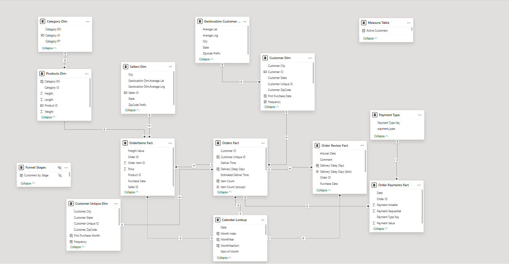

# Olist E-Commerce Power BI Project

## Overview
This Power BI project provides a comprehensive analysis of Olist's e-commerce dataset. It includes interactive dashboards and reports that analyze sales, customer behavior, product performance, and operational metrics over time. The goal is to deliver actionable insights into revenue trends, customer engagement, and order patterns, helping stakeholders make data-driven decisions.

---

## Data Model
The data model follows a **snow flake schema** with **fact tables** and **dimension tables**, ensuring optimized performance and easy report building.

### Fact Tables
- **Orders Fact** – Contains order-level data including order IDs, purchase dates, and delivery metrics.
- **Order Items Fact** – Holds detailed line-item data including product IDs, prices, and freight values.
- **Order Review Fact** – Records customer review scores, comments, and delivery delay data.
- **Order Payments Fact** – Includes payment details such as payment type, amount, and installment info.

### Dimension Tables
- **Customer Dim / Customer Unique Dim** – Stores unique customer profiles with geographical and behavioral attributes.
- **Products Dim** – Lists product details such as category and dimensions (weight, height, length).
- **Category Dim** – Categorizes products into multiple language categories (EN/PT).
- **Sellers Dim** – Includes seller information like location and seller IDs.
- **Geolocation Customer Dim** – Provides latitude/longitude and zip code details for customer locations.
- **Calendar Lookup** – A calendar table for time intelligence, including month, year, and period flags.
- **Payment Type** – Defines available payment methods (credit card, boleto, etc.).
- **Measure Table** – Stores calculated measures such as Active Customers.

### Other Tables
- **Funnel Stages** – Used for modeling customer purchase stages.

---

## Key Dashboards and Insights
From the provided report:
- **Executive Overview**
  - Total Revenue: **$15M**
  - Total Orders: **92K**
  - Total Customers: **90K**
  - Average Order Value (AOV): **$16**
  - Year-to-Date (YTD) Revenue: **$7.64M**
  - Month-to-Date (MTD) Revenue: **$1.06M**
- **Sales Analysis**
  - Revenue and orders over time (month-over-month, year-over-year).
  - Top 10 product categories by revenue (e.g., Health Beauty, Watches Gifts).
  - Top 10 cities by revenue (e.g., São Paulo, Rio de Janeiro).
- **Customer Analysis**
  - New vs. returning customers.
  - Repeat purchase rate (3.09%).
  - Customer purchase funnel (1st → 2nd → 3rd purchase).
- **Review Analysis**
  - Average review score: **4.07**.
  - Word cloud of common customer feedback terms.
- **Category Insights**
  - Top-selling products and sellers per category.
  - Category revenue trends and distribution.

---

## Features
- Interactive filters for **time periods, categories, and geographies**.
- Drill-down capability for detailed insights (e.g., Executive Overview → Category Detail).
- Time intelligence metrics: **YTD, MTD, YoY, and MoM** growth.
- Customer segmentation using **RFM metrics**.
- **Payment mix analysis** to track revenue share by payment type.

---

## Technologies Used
- **Power BI Desktop** – Data modeling, report building, and dashboard creation.
- **DAX (Data Analysis Expressions)** – For measures like AOV, revenue growth, and repeat rate.
- **Data Cleaning and Transformation** – Performed using Power Query (M language).

---

## How to Use
1. Open the `.pbix` file in **Power BI Desktop**.
2. Navigate to different pages (Executive Overview, Sales Analysis, Customer Behavior, etc.).
3. Use slicers to filter by **time, category, seller, or city**.

---

## Future Improvements
- Add predictive analysis for sales forecasting.
- Integrate external datasets (e.g., marketing campaigns, weather data).
- Enhance RFM segmentation with clustering methods.

---

## Data Model Diagram
Below is the data model diagram for this Power BI project:

